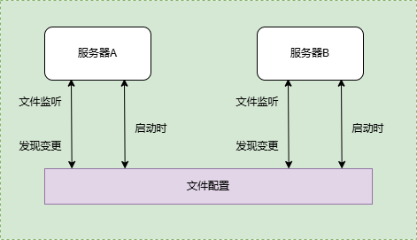

# 博客后端
>使用gin框架进行开发

## 基础业务
+ 标签管理
+ 文章管理

## 目录结构
```shell
blog-service
├─configs             # 配置文件
├─docs                # 文档集合
├─internal            # 内部模块
│  ├─dao              # 数据访问层， 所有与数据相关的操作都会在dao层进行，例如mysql、Elasticsearch
│  ├─middleware       # HTTP中间件
│  ├─model            # 模型层， 用于存放model 对象
│  ├─routers          # 路由相关的逻辑
│  └─service          # 项目核心业务逻辑
├─pkg                 # 项目相关的模块包
├─scripts             # 项目生成的临时文件
├─storage             # 各类构建、安装、分析等操作的脚本
└─third_party         # 第三方的资源工具，如swagger UI
```

## 路由
### 标签管理
|     功能     | HTTP方法 |   路径    |
| :----------: | :------: | :-------: |
|   新增标签   |   POST   |   /tags   |
| 删除指定标签 |  DELETE  | /tags/:id |
| 更新指定标签 |   PUT    | /tags/:id |
| 获取标签列表 |   GET    |   /tags   |


### 文章管理
|     功能     | HTTP方法 |     路径      |
| :----------: | :------: | :-----------: |
|   新增文章   |   POST   |   /articles   |
| 删除指定文章 |  DELETE  | /articles/:id |
| 更新指定文章 |   PUT    | /articles/:id |
| 获取指定文章 |   GET    | /articles/:id |
| 获取文章列表 |   GET    |   /articles   |

## 公共组件

1. 错误码标准化
2. 配置管理


    + 启动时：可以进行一些初始化行为，如配置基础应用属性、连接第三方实列(MySQL、NoSQL)等
    + 在运行中: 可以通过监听文件或者变更其他存储载体来实现热更新配置效果。
    + 配置组件分为：文件配置和配置中心模式，本项目采用文件配置
1. 数据库连接
2. 日志写入
3. 响应处理

